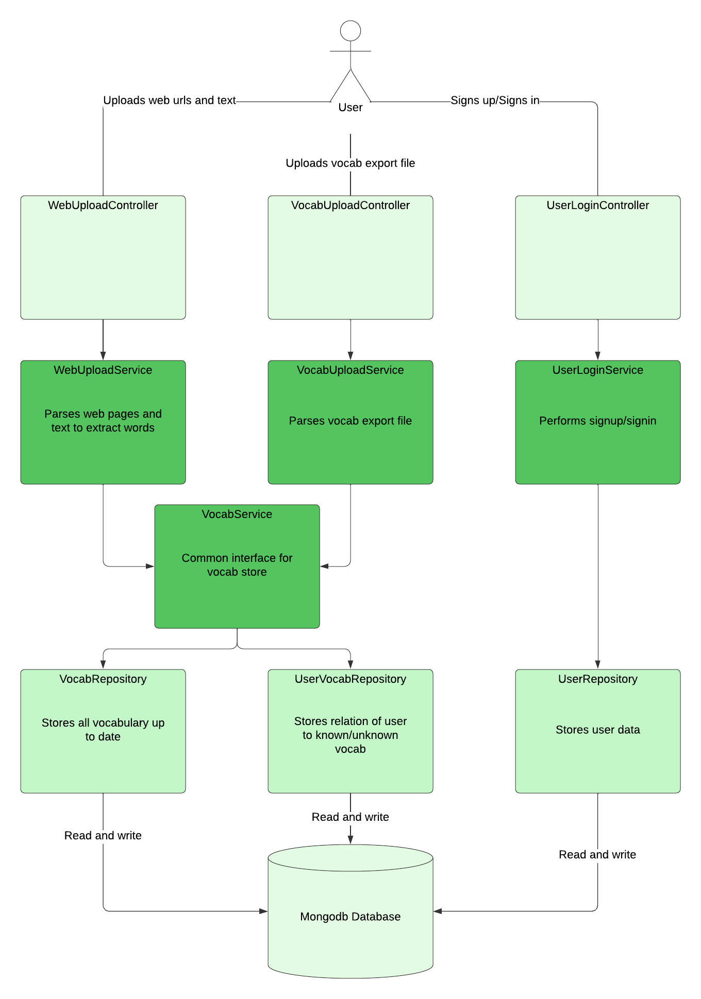

### Japanese comprehension API

_1. User uploads urls to web pages and gets total/per page unknown words_

_2. User uploads text and gets total/per page unknown words_

_3. ~~User uploads known words (jpdb/anki)~~_

_4. ~~User creates account~~_
___

_1. App parses web url_

_2. App calculates unknown words_

_3. App stores unknown words_

_4. App returns all unknown words_

_5. App appends meaning/reading to unknown words_

_6. ~~App accepts known words (jpdb/anki)~~_

_7. App removes previous unknown words if known words updated_

_8. App accepts user login via oauth_ 

